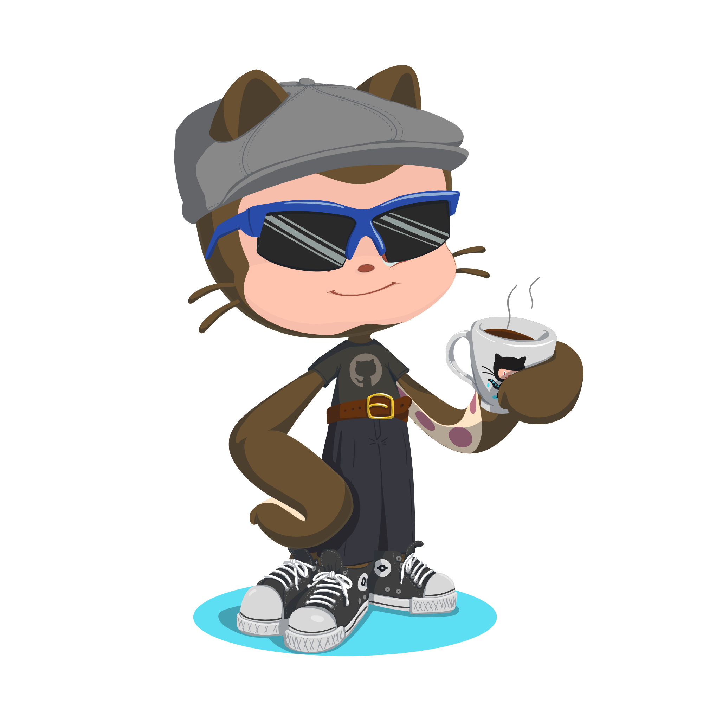

 
 <h1 align="left">Leandro Ribeiro de Padua</h1>
  
  
  

 

## Eai, beleza!!

I'm 21 years old, live in Campinas/SP - Brazil. I'm entering in this world of programming. Big challengs are coming and I'm ready to face them!(at least until coffee runs out)!  🙌
 

### 🖥️ Languages and Technologies that i'm practicing:

<code></code>
<code></code>
<code></code>
<code></code>
<code></code>
<code></code>

 
 

 
☕ No coffee, no code;

 
📚 I'm studying JavaScript to deepen my knowledge of Front-end;

 
📷 I share my experiences and projects here on Github and LinkedIn!

 
🕹️ I like to play in my free time, read some books and news about Technologies. Did I mention that I like coffee?

 
📫 You can message me on Instagram or LinkedIn
     

<a href="https://github.com/LeandroRPP">
  
  

